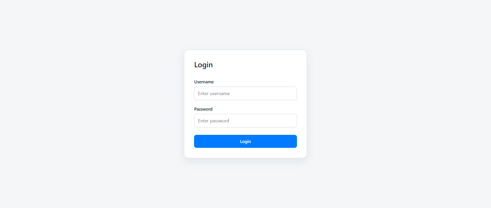

# Certificate Approval App

A role-based certificate request and approval web application built with **Node.js**, **Express**, **EJS**, and **MongoDB**, integrated with **OpenXPKI** as the Certificate Authority.

The application implements a two-level approval workflow:
- **Level 1** — Approver reviews and approves the request in this app
- **Level 2** — RA Operator approves the enrollment workflow in the OpenXPKI web UI

Only after both approvals does OpenXPKI issue the signed certificate.

---

## Project Requirements

1. Clone and run using the OpenXPKI community Docker setup
2. Use custom OpenXPKI configurations
3. Generate a fallback self-signed certificate if OpenXPKI is unavailable. If both fail, move to a clear FAILED state with retry/admin action
4. Client-side key generation and CSR upload to the Node.js app
5. Improve and update this implementation guide

---

## Features

### Requester (john)
- Fills certificate request form (CN, Organization, OU, Country, Email)
- RSA-2048 key pair generated in the browser using forge.js — private key never sent to server
- Only the CSR is uploaded to the server
- Views submitted requests and their status
- Checks issuance status after approval
- Downloads the issued certificate as `.crt`

### Approver (selina)
- Views pending certificate requests
- Approves a request — submits CSR to OpenXPKI
- Rejects a request with an optional reason
- Views approved and failed requests
- Retries failed requests when the CA is back online

### OpenXPKI Integration
- CSR submitted via RPC `RequestCertificate` endpoint
- Certificate picked up via `transaction_id` using the built-in `check_enrollment` pickup workflow
- Fallback self-signed certificate generated server-side if OpenXPKI is unreachable
- If both OpenXPKI and fallback fail — request moves to `FAILED` state with a Retry button

---

## Certificate Status Flow

```
PENDING   → Submitted by requester, awaiting approver action
APPROVED  → Approver approved, CSR sent to OpenXPKI, awaiting RA Operator
ISSUED    → Certificate issued by OpenXPKI CA
REJECTED  → Rejected by approver or by RA Operator in OpenXPKI
FALLBACK_ISSUED → OpenXPKI unavailable, self-signed certificate issued
FAILED    → Both OpenXPKI and fallback failed, retry available
```

---

## Tech Stack

- **Backend:** Node.js, Express.js
- **Frontend:** EJS, CSS
- **Database:** MongoDB Atlas
- **Authentication:** express-session, bcrypt
- **PKI / CA:** OpenXPKI (Docker)
- **Client-side crypto:** forge.js (CDN)
- **HTTP client:** Axios
- **ORM:** Mongoose

---

## Project Structure

```
certificate-approval-app/
├── app.js
├── .env                        ← real credentials, never committed
├── .env.example                ← template for setup
├── .gitignore
├── package.json
├── config/
│   └── db.js                   ← MongoDB connection
├── controllers/
│   ├── approverController.js   ← approve, reject, retry logic
│   ├── authController.js       ← login, logout, dashboard
│   ├── certificateController.js← download certificate
│   └── requesterController.js  ← submit request, check issuance
├── middleware/
│   └── authMiddleware.js       ← session + role guards
├── models/
│   ├── Certificate.js          ← issued certificate storage
│   ├── CertificateRequest.js   ← request + status tracking
│   └── User.js                 ← user accounts
├── public/
│   └── styles.css
├── routes/
│   ├── approverRoutes.js
│   ├── authRoutes.js
│   ├── certificateRoutes.js
│   └── requesterRoutes.js
├── seed/
│   └── seedUsers.js            ← creates john and selina
├── services/
│   ├── csrService.js           ← generateCsr, generateSelfSignedCert
│   └── openxpkiService.js      ← requestCertificate, pickupCertificate
└── views/                      ← EJS templates
```

---

## Environment Variables

Copy `.env.example` to `.env` and fill in your values:

```env
PORT=5000
SESSION_SECRET=replace_with_random_64_character_string
MONGODB_URI=mongodb+srv://<username>:<password>@<cluster>.mongodb.net/<dbname>
OPENXPKI_RPC_GENERIC_URL=https://localhost:9443/rpc/generic
OPENXPKI_RPC_PUBLIC_URL=https://localhost:9443/rpc/public
```

Generate a strong session secret:
```bash
node -e "console.log(require('crypto').randomBytes(32).toString('hex'))"
```

---

## OpenXPKI Docker Setup

### 1. Start OpenXPKI

From the `openxpki-docker` directory:

```bash
docker compose up -d
```

Wait for all containers to be healthy:

```bash
docker compose ps
```

### 2. Access OpenXPKI Web UI

```
https://localhost:9443/webui/index/#/openxpki/login
```

Login as RA Operator:
- **Username:** `raop`
- **Password:** `openxpki`

### 3. Custom Configurations Applied

The following settings were customized in:
`openxpki-config/config.d/realm.tpl/rpc/generic.yaml`

| Setting | Value | Purpose |
|---|---|---|
| `approval_points` | `1` | RA Operator must manually approve each enrollment |
| `export_certificate` | `chain` | Returns certificate PEM directly in the RPC response |
| `max_active_certs` | `1` | Only one active cert per CN allowed |
| `auto_revoke_existing_certs` | `1` | Old cert auto-revoked when new one is issued |
| `initial_validity` | `+000030` | Certificates valid for 30 days in demo |
| `eligible connector` | `\w+\.openxpki.test` | Only CNs ending in `.openxpki.test` are accepted |
| `allow_man_approv` | `1` | RA Operator can approve/reject in the web UI |

`approval_points: 1` is the key setting that enforces the two-level approval workflow — without it, OpenXPKI would auto-approve every request the moment your app submits it.

---

## How to Install and Run

### 1. Clone the repository

```bash
git clone <your-repository-url>
cd certificate-approval-app
```

### 2. Install dependencies

```bash
npm install
```

### 3. Create `.env` file

```bash
cp .env.example .env
```

Fill in your MongoDB URI and session secret.

### 4. Seed the database

```bash
npm run seed
```

Creates two users:
- `john` / `requester123` — Requester role
- `selina` / `approver123` — Approver role

### 5. Start OpenXPKI Docker

```bash
cd ../openxpki-docker
docker compose up -d
cd ../certificate-approval-app
```

### 6. Start the application

Development:
```bash
npm run dev
```

Production:
```bash
npm start
```

### 7. Open the app

```
http://localhost:5000
```

---

## Application Workflow

### Normal Flow (OpenXPKI Online)

1. **John** logs in → fills certificate request form
2. Browser generates RSA-2048 key pair using forge.js
3. CSR signed in browser — private key never leaves the browser
4. Only CSR uploaded to server → saved as `PENDING`
5. **Selina** logs in → views Pending Requests → clicks Approve
6. App submits CSR to OpenXPKI via `RequestCertificate` RPC
7. OpenXPKI creates an enrollment workflow → status: `APPROVED`
8. **RA Operator** logs into OpenXPKI web UI → approves the workflow
9. **John** clicks Check Issuance → app calls pickup with `transaction_id`
10. OpenXPKI returns certificate PEM → status: `ISSUED`
11. John downloads `.crt` from My Certificates

### Fallback Flow (OpenXPKI Unavailable)

1. Selina approves → OpenXPKI is unreachable → connection fails
2. App generates a fresh key pair server-side
3. Self-signed certificate created using OpenSSL
4. Status: `FALLBACK_ISSUED` — cert available for download immediately
5. Note shown: certificate is self-signed and not CA-trusted

### Rejection Flow

**Approver rejects:**
- Selina clicks Reject with optional reason
- Status: `REJECTED` — no further action

**RA Operator rejects in OpenXPKI:**
- John clicks Check Issuance
- Pickup returns `FAILURE` state
- Status: `REJECTED` — "Declined by the certificate authority"

### Failed + Retry Flow

1. OpenXPKI unreachable AND OpenSSL also fails
2. Status: `FAILED` — Retry button shown to approver
3. Once CA is back online → Selina clicks Retry
4. Old OpenXPKI IDs cleared → fresh CSR submitted → new workflow created
5. Normal flow continues from step 8 above

---

## API Endpoints

### Authentication
| Method | Route | Description |
|---|---|---|
| GET | `/` | Login page |
| POST | `/login` | Login |
| GET | `/dashboard` | Role-based dashboard |
| POST | `/logout` | Logout |

### Requester
| Method | Route | Description |
|---|---|---|
| GET | `/request` | Certificate request form |
| POST | `/request` | Submit certificate request |
| GET | `/my-requests` | View own requests |
| POST | `/my-requests/check-issued/:requestId` | Check issuance status |
| GET | `/certificates` | View issued certificates |
| GET | `/certificates/:id/download` | Download certificate as .crt |

### Approver
| Method | Route | Description |
|---|---|---|
| GET | `/pending` | View pending requests |
| GET | `/pending/:requestId` | View request details |
| POST | `/approve/:requestId` | Approve and submit to OpenXPKI |
| POST | `/reject/:requestId` | Reject with reason |
| POST | `/retry/:requestId` | Retry a failed request |
| GET | `/approved` | View approved requests |
| GET | `/failed` | View failed requests |

---

## OpenXPKI Integration Details

### RPC Methods Used

**RequestCertificate** — used for both submission and pickup:
```javascript
// Submit CSR
POST /rpc/generic/RequestCertificate
{ pkcs10: csrPem, comment: "Approved by selina..." }

// Pickup result using transaction_id
POST /rpc/generic/RequestCertificate
{ transaction_id: "28af05449913ac25f2b7b3d2c972a067ea8111fb" }
```

The pickup mechanism uses OpenXPKI's built-in `check_enrollment` workflow configured under the `pickup` section of `generic.yaml`. Sending a `transaction_id` instead of a `pkcs10` triggers the pickup path — returning the current state of the workflow (`SUCCESS`, `FAILURE`, or pending).

### Authentication

The generic RPC endpoint uses `auth: stack: _System` — no login session is needed. Calls are made directly without credentials. The Docker network acts as the trust boundary.

### Certificate Download

Certificates are downloaded as `.crt` files. The content is PEM format (base64-encoded DER with headers). The `.crt` extension allows Windows to open the file directly in the Certificate Manager.

---

## Test Credentials

| Role | Username | Password |
|---|---|---|
| Requester | `john` | `requester123` |
| Approver | `selina` | `approver123` |
| RA Operator (OpenXPKI) | `raop` | `openxpki` |

---

## Troubleshooting

### MongoDB connection fails
- Verify `MONGODB_URI` in `.env` is correct
- Check MongoDB Atlas IP whitelist includes your IP

### OpenXPKI containers unhealthy
```bash
docker compose logs --tail=100
docker compose ps
```

Restart if needed:
```bash
docker compose down && docker compose up -d
```

### Certificate request rejected with "eligible" error
- Common Name must match `*.openxpki.test`
- Example valid CN: `myapp.openxpki.test`

### Check Issuance says "still being processed"
- RA Operator has not yet approved in the OpenXPKI web UI
- Login at `https://localhost:9443/webui` as `raop` / `openxpki`
- Go to Outstanding Tasks and approve the enrollment

### Fallback certificate not trusted
- This is expected — self-signed certs are not trusted by default
- Install the cert in your Trusted Root CA store to trust it locally
- In production, always ensure OpenXPKI is available

---

```md
## Screenshots



```

---

## Author

**Haseeb Tariq**
