# Certificate Approval App

A role-based certificate request and approval web application built with **Node.js**, **Express**, **EJS**, **MongoDB**, and **OpenXPKI**.

This project implements a simple certificate issuance workflow with two predefined roles:
- **Requester**: submits certificate requests and checks issuance status
- **Approver**: reviews pending requests and approves or rejects them

Once a request is approved, the application sends the CSR to **OpenXPKI** for processing. The requester can later check whether the certificate has been issued and download the issued certificate in **PEM** format.

---

## Features

- Session-based authentication with role-based access
- Two predefined test users:
  - **john / requester123** → Requester
  - **selina / approver123** → Approver
- Requester can:
  - submit a certificate request
  - view their submitted requests
  - check issuance status for approved requests
  - view and download issued certificates
- Approver can:
  - view pending requests
  - view request details
  - approve a request and send it to OpenXPKI
  - reject a request with a rejection reason
  - view approved requests
- CSR generation using OpenSSL from the backend
- Certificate request and issued certificate data stored in MongoDB
- OpenXPKI integration for:
  - request submission
  - certificate search / issuance check
  - connectivity testing

---

## Tech Stack

- **Backend:** Node.js, Express.js
- **Frontend:** EJS, CSS
- **Database:** MongoDB Atlas (or local MongoDB if preferred)
- **Authentication:** express-session
- **PKI / Issuance Engine:** OpenXPKI (Docker-based local setup)
- **Other:** OpenSSL, Axios, Mongoose, bcrypt, dotenv

---

## Project Structure

```text
certificate-approval-app/
├── app.js
├── config/
│   └── db.js
├── controllers/
├── middleware/
├── models/
├── public/
├── routes/
├── seed/
│   └── seedUsers.js
├── services/
│   ├── csrService.js
│   └── openxpkiService.js
├── views/
├── .env
├── package.json
└── package-lock.json
```

---

## Environment Variables Required

Create a `.env` file in the project root and add the following:

```env
PORT=5000
MONGODB_URI=your_mongodb_connection_string
SESSION_SECRET=your_session_secret
OPENXPKI_RPC_GENERIC_URL=https://localhost:8443/rpc/generic
OPENXPKI_RPC_PUBLIC_URL=https://localhost:8443/rpc/public
OPENXPKI_METHOD_REQUEST_CERT=RequestCertificate
OPENXPKI_METHOD_SEARCH_CERT=SearchCertificate
OPENXPKI_METHOD_TEST_CONNECTION=TestConnection
```

### Notes
- `MONGODB_URI` should point to your MongoDB Atlas cluster or local MongoDB instance.
- `SESSION_SECRET` can be any random secret string.
- The OpenXPKI RPC URLs above assume the default local Docker setup exposed on port **8443**.
- The current code uses `https.Agent({ rejectUnauthorized: false })` for local development against self-signed OpenXPKI certificates.

---

## OpenXPKI Installation / Setup Steps Taken

This project uses a local Docker-based OpenXPKI setup.

### 1. Clone or prepare the OpenXPKI Docker project
Keep the OpenXPKI Docker setup in a separate folder, for example:

```bash
openxpki-docker/
```

### 2. Configure OpenXPKI public search RPC
The following file was updated so the public RPC can return the PEM certificate after issuance:

```text
openxpki-config/client.d/service/rpc/public.yaml
```

`SearchCertificate` output should include:

```yaml
SearchCertificate:
    workflow: certificate_search
    input:
      - common_name
    output:
      - cert_identifier
      - notbefore
      - notafter
      - status
      - certificate
```

### 3. Configure certificate search workflow mapping
The certificate search workflow should expose the PEM certificate using the certificate identifier.

File used:

```text
openxpki-config/config.d/realm.tpl/workflow/def/certificate_search.yaml
```

The workflow action should map the certificate PEM using:

```yaml
_map_certificate: "[% USE Certificate %][% Certificate.pem(context.cert_identifier) %]"
```

### 4. Configure CLI key for the Docker setup
A client key file is mounted into the OpenXPKI server container. The key file should exist at:

```text
openxpki-docker/config/client.key
```

The corresponding public key was configured in:

```text
openxpki-config/config.d/system/cli.yaml
```

### 5. Update Docker health checks
For local development, the default health checks were too strict. Health check timing was relaxed in `docker-compose.yml` so the server, client, and web containers have enough time to become healthy.

### 6. Start OpenXPKI containers
From the `openxpki-docker` directory:

```bash
docker compose up -d server
docker compose up -d client
docker compose up -d web
```

Or simply:

```bash
docker compose up -d web
```

### 7. Access OpenXPKI Web UI
Open:

```text
http://localhost:8080
```

or

```text
https://localhost:8443
```

---

## How to Install and Run This Application

### 1. Clone the repository

```bash
git clone <your-repository-url>
cd certificate-approval-app
```

### 2. Install dependencies

```bash
npm install
```

### 3. Create the `.env` file
Add the environment variables shown above.

### 4. Seed the database with test users

```bash
npm run seed
```

This inserts the following predefined users:

- `john` / `requester123`
- `selina` / `approver123`

### 5. Start the app
For development:

```bash
npm run dev
```

For normal run:

```bash
npm start
```

### 6. Open the application

```text
http://localhost:5000
```

---

## Application Workflow

### Requester Flow
1. Log in as **john**.
2. Open the request form.
3. Submit certificate details:
   - Common Name
   - Organization
   - Organizational Unit
   - Country
   - Email
4. View submitted requests in **My Requests**.
5. After approval, click **Check Issuance**.
6. Once issued, open **My Certificates** and download the certificate.

### Approver Flow
1. Log in as **selina**.
2. Open **Pending Requests**.
3. Review request details.
4. Approve the request to submit it to OpenXPKI, or reject it with a reason.
5. View approved requests in **Approved Requests**.

---

## Available Routes

### Authentication
- `GET /` → Login page
- `POST /login` → Login
- `GET /dashboard` → Role-based dashboard
- `POST /logout` → Logout

### Requester
- `GET /request` → Certificate request form
- `POST /request` → Submit certificate request
- `GET /my-requests` → View own requests
- `POST /my-requests/check-issued/:requestId` → Check issuance status
- `GET /certificates` → View issued certificates
- `GET /certificates/:id/download` → Download issued certificate

### Approver
- `GET /pending` → View pending requests
- `GET /pending/:requestId` → View request details
- `POST /approve/:requestId` → Approve request and send CSR to OpenXPKI
- `POST /reject/:requestId` → Reject request with reason
- `GET /approved` → View approved requests

---

## Database Seeding Details

The seed script is located at:

```text
seed/seedUsers.js
```

It:
- connects to MongoDB using `MONGODB_URI`
- removes any existing `john` and `selina` users
- hashes the passwords using bcrypt
- recreates the two predefined users

Run with:

```bash
npm run seed
```

---

## OpenXPKI Integration Notes

The application currently integrates with OpenXPKI in these ways:

- **RequestCertificate**: sends the CSR to OpenXPKI after approver approval
- **SearchCertificate**: checks whether the certificate has been issued and retrieves certificate metadata / PEM
- **TestConnection**: connectivity test endpoint

The OpenXPKI service logic is implemented in:

```text
services/openxpkiService.js
```

---

```md
## Screenshots

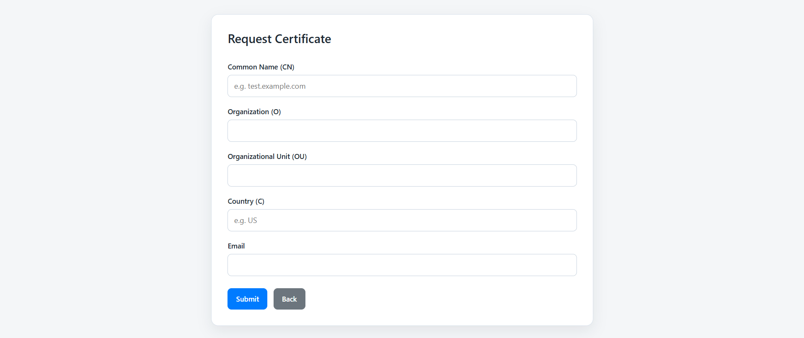
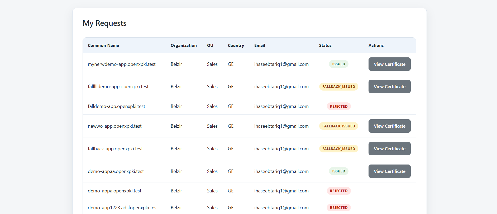
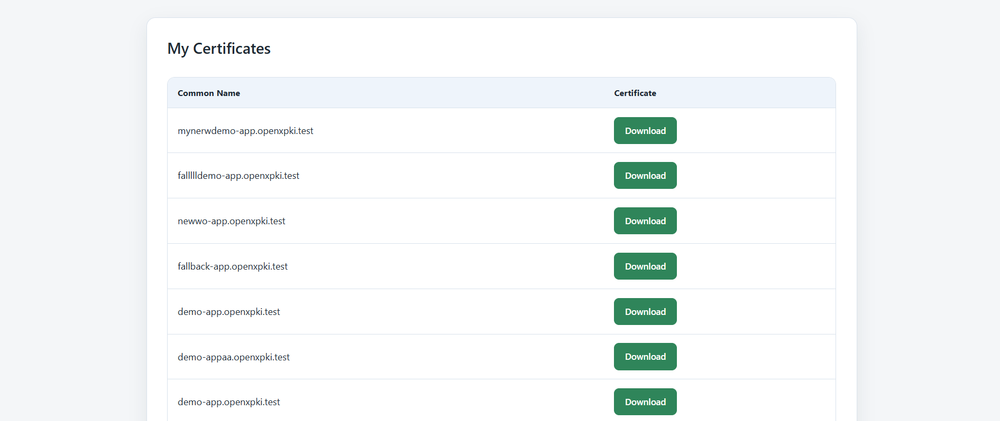
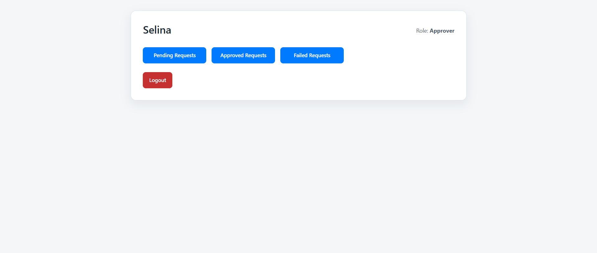
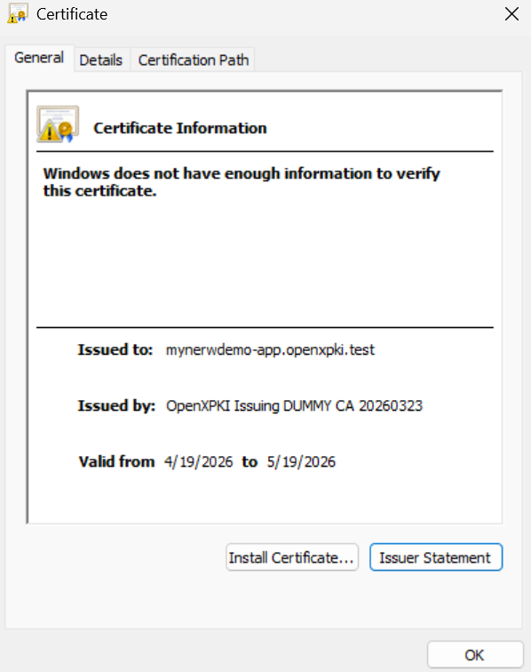
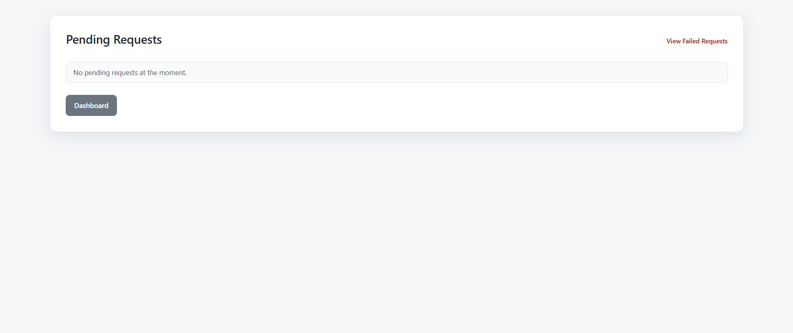
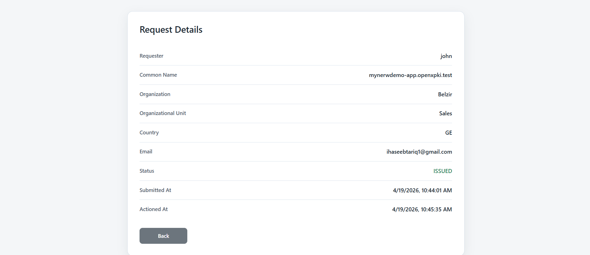
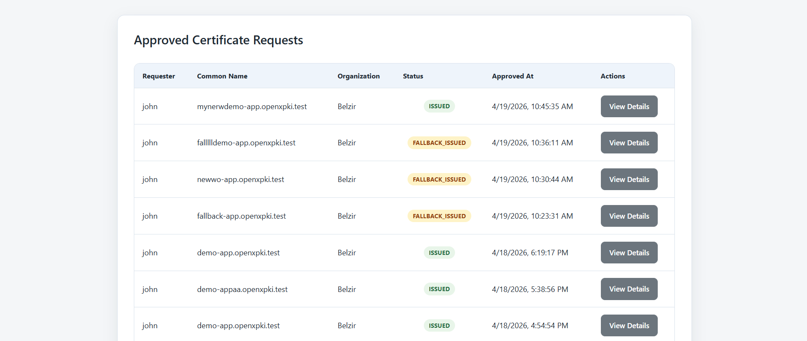
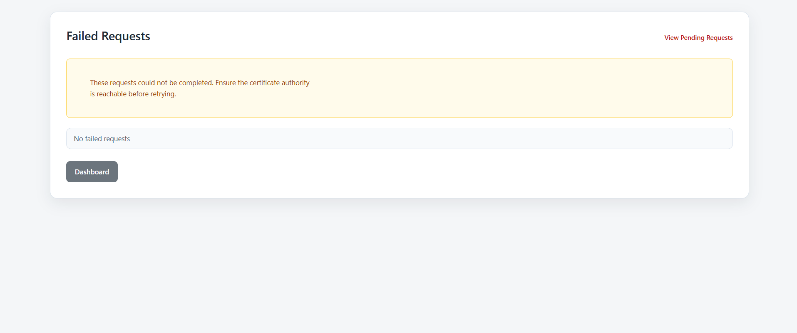
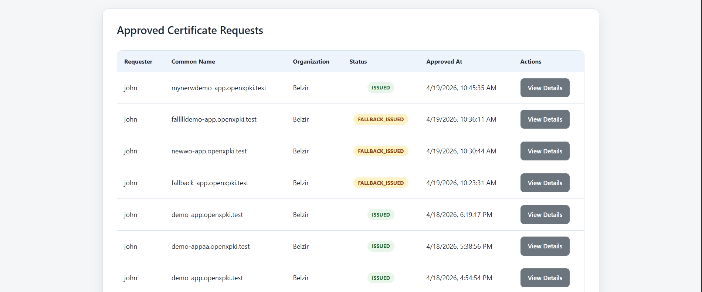
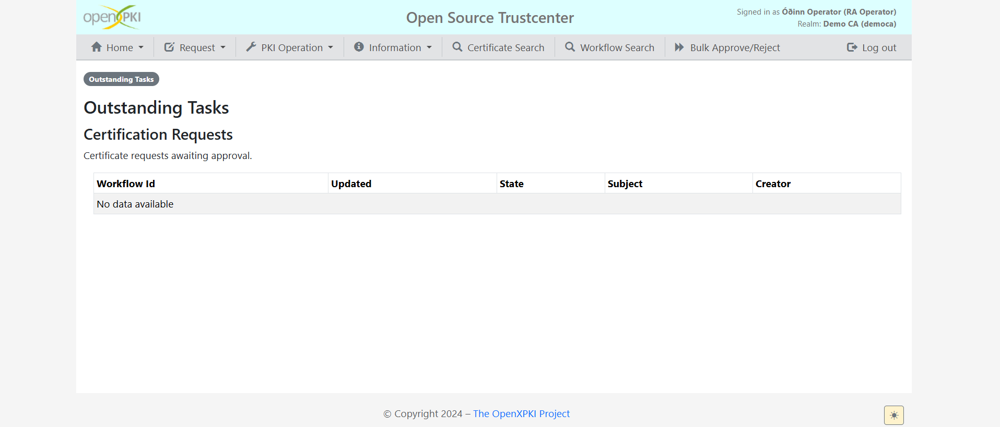
```

---

## Current Implementation Notes

- The application stores request records, approval state, and issued certificates in MongoDB.
- CSR generation is handled server-side.
- Issued certificates can be downloaded in `.pem` format and if you can't access the certificate on your pc, change the extension to crt.
- The requester can check issuance status manually after approval.
- Rejection reason support is implemented.
- Pending request list includes the key request information for approver review.

---

## Test Credentials

### Requester
- **Username:** `john`
- **Password:** `requester123`

### Approver
- **Username:** `selina`
- **Password:** `approver123`

---

## Troubleshooting

### MongoDB connection fails
- Verify `MONGODB_URI` is correct.
- Ensure your MongoDB Atlas IP whitelist or local MongoDB service is configured properly.

### OpenXPKI containers are unhealthy
- Check Docker container logs:

```bash
docker compose logs server --tail=200
docker compose logs client --tail=200
docker compose logs web --tail=200
```

- Ensure `config/client.key` exists in the OpenXPKI Docker folder.
- Ensure `cli.yaml` contains the matching public key.
- Ensure health check values in `docker-compose.yml` are not too strict.

### Certificate not returned after issuance
- Verify `public.yaml` includes `certificate` in the `SearchCertificate` output.
- Verify `certificate_search.yaml` maps `_map_certificate` correctly.

---

## Author

**Haseeb Tariq**